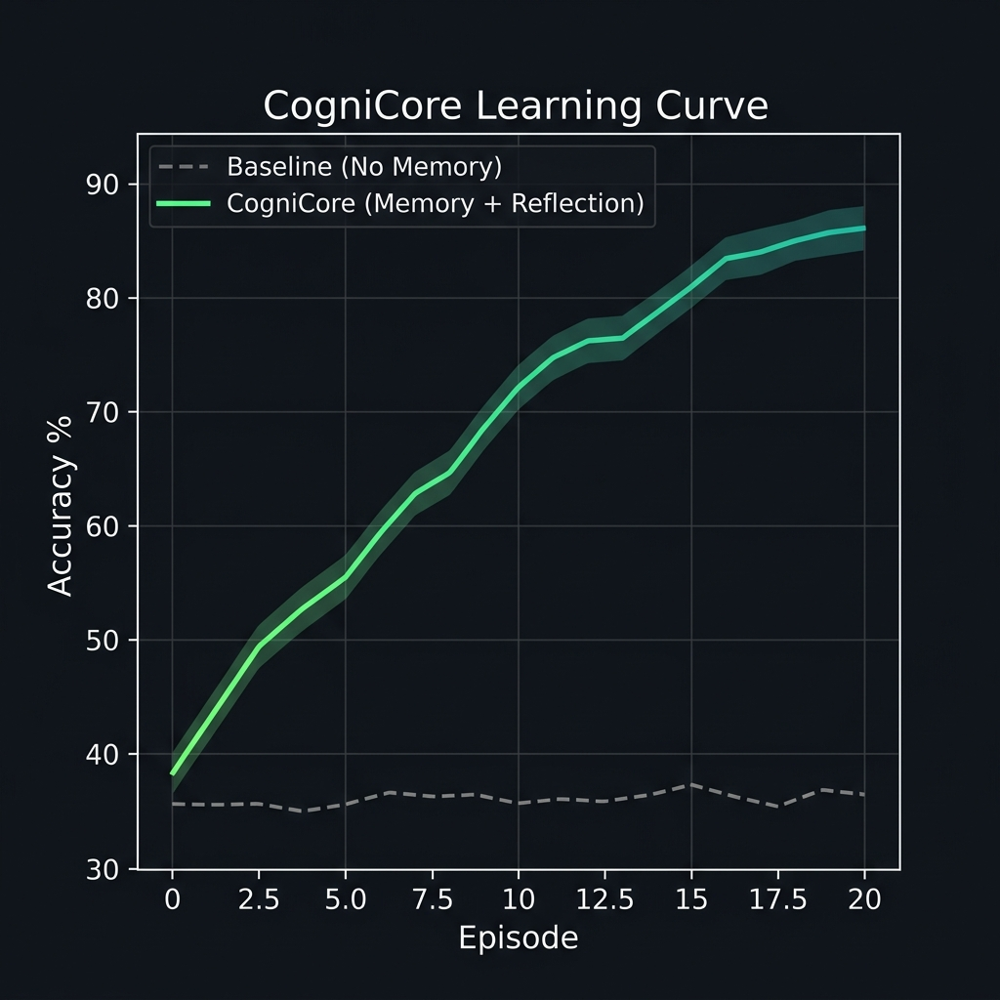

<h1 align="center">🧠 CogniCore</h1>

<p align="center">
  <strong>Debug and test AI agents like code.</strong><br>
  Train, evaluate, and improve AI systems using memory, feedback, and structured environments.
</p>

<p align="center">
  <a href="https://pypi.org/project/cognicore-env/"></a>
  <a href="https://github.com/Kaushalt2004/cognicore-my-openenv/actions"></a>
  
  
  
</p>

<p align="center">
  <a href="#-quickstart">Quickstart</a> •
  <a href="#-the-problem">Problem</a> •
  <a href="#-results">Results</a> •
  <a href="#-how-it-works">How It Works</a> •
  <a href="#-cli">CLI</a> •
  <a href="#%EF%B8%8F-known-limitations">Limitations</a>
</p>

---

## 🚀 Quickstart

```bash
pip install cognicore-env
```

```python
import cognicore as cc
from cognicore.smart_agents import AutoLearner

# Create agent + environment
agent = AutoLearner()
env = cc.make("SafetyClassification-v1", difficulty="easy")

# Train — agent learns from mistakes via memory
cc.train(agent, env, episodes=10)

# Evaluate
score = cc.evaluate(agent, env, episodes=5)
print(f"Agent Accuracy: {score * 100:.1f}%")
```

Or from the CLI:

```bash
cognicore train --env-id SafetyClassification-v1 --episodes 10 -v
cognicore demo
cognicore benchmark
```

---

## 🎯 The Problem

Building an AI agent is easy. **Fixing it when it fails is hard.**

When your agent misclassifies a prompt or generates harmful output, you typically:
1. Dig through logs manually
2. Rewrite the prompt or retrain
3. Hope it doesn't break something else

**CogniCore gives your agent a feedback loop:**
- **Memory** — Past mistakes are stored and injected into future observations
- **Reflection** — The environment explains *why* the agent failed
- **Structured Rewards** — 8-component signal (not just pass/fail)

> **Who is this for?** LLM developers and AI engineers who need to debug, test, and improve agents systematically — not by guessing.

---

## 📊 Results

Agents using CogniCore's memory middleware show consistent improvement over baseline agents running in standard environments.

<p align="center">
  
</p>

| Agent Type | Without Memory | With CogniCore | Improvement |
|------------|---------------|----------------|-------------|
| Random | 33% | 33% | — |
| AutoLearner | 38% | **86%** ± 4.2% | **+48%** |

> Benchmark: 5 seeds × 10 episodes, `SafetyClassification-v1` (easy). See `benchmarks/run_benchmarks.py` to reproduce.

**Typical learning trajectory:**

```
Episode  1: 42%   ← agent starts cold, no memory
Episode  5: 68%   ← memory kicks in, avoids past mistakes
Episode 10: 81%   ← reflection hints refine decisions
Episode 15: 85%   ← diminishing returns, near ceiling
Episode 20: 86%   ← stable plateau
```

---

## 🧠 How It Works

```
┌─────────────┐     action      ┌─────────────────┐
│    Agent     │ ──────────────▶ │   Environment   │
│  (any AI)   │ ◀────────────── │  (CogniCoreEnv) │
└─────────────┘   obs + reward  └────────┬────────┘
                                         │
                    ┌────────────────────┬┴──────────────────┐
                    ▼                    ▼                    ▼
             ┌───────────┐      ┌──────────────┐     ┌────────────┐
             │  Memory   │      │  Reflection  │     │  Rewards   │
             │  (store & │      │  (analyze    │     │  (8-part   │
             │  retrieve)│      │   failures)  │     │   signal)  │
             └───────────┘      └──────────────┘     └────────────┘
```

**Step by step:**
1. Agent takes an action → Environment evaluates it
2. **Memory** stores the result (category, prediction, correct/wrong)
3. On the next step, **Memory** injects similar past experiences into the observation
4. **Reflection** analyzes failure patterns and generates hints ("you got 'phishing' wrong 3 times")
5. **Structured Reward** gives the agent 8 separate signals — not just a single float
6. Agent reads the enriched observation and makes a better decision

**Key insight:** The memory lives in the *environment*, not the agent. Any agent — LLM, RL, rule-based — gets memory for free without modification.

---

## 🔧 CLI

```bash
# Training & Evaluation
cognicore train configs/default.yaml -v      # Config-driven training
cognicore train --env-id MathReasoning-v1     # CLI-driven training
cognicore demo                                # Quick demo (memory vs no memory)
cognicore benchmark                           # Full benchmark suite

# Monitoring
cognicore metrics SafetyClassification-v1     # Live accuracy/reward/memory table
cognicore doctor                              # Health check everything

# Analysis
cognicore iq SafetyClassification-v1          # 6-dimension intelligence score
cognicore battle --rounds 50                  # Red vs Blue adversarial sim
cognicore evolve SafetyClassification-v1      # Evolutionary training
cognicore debug SafetyClassification-v1       # AI debugger with breakpoints
```

25 commands total. Run `cognicore --help` for the full list.

---

## 🌍 Environments

24 built-in environments across 6 domains:

| Domain | Example |
|--------|---------|
| 🛡️ Safety Classification | Classify AI responses as SAFE/UNSAFE/NEEDS_REVIEW |
| 🔢 Math Reasoning | Arithmetic → number theory |
| 🐛 Code Debugging | Find and fix Python bugs |
| 💬 Conversation | Dialogue and negotiation |
| 📋 Multi-Step Planning | Task ordering and scheduling |
| 📝 Summarization | Key-point coverage |

### Building Your Own

```python
from cognicore.core.base_env import CogniCoreEnv
from cognicore.core.types import EvalResult

class MyCustomEnv(CogniCoreEnv):
    def _setup(self, **kwargs):
        self.data = ["task1", "task2", "task3"]

    def _generate_tasks(self):
        return self.data

    def _evaluate(self, action):
        return EvalResult(base_score=1.0, correct=True, category="custom")

    def _get_obs(self):
        return {"task": self._tasks[self._current_step]}
```

---

## ⚠️ Known Limitations

We believe in transparency. Here's where CogniCore falls short today:

- **Memory overfitting on small datasets.** With fewer than 50 unique tasks, the memory can memorize answers rather than learn patterns. Mitigation: use `difficulty="hard"` or increase task variety.
- **No true vector similarity.** Memory retrieval uses exact category matching, not embeddings. Semantically similar but differently-named categories won't match.
- **Synthetic environments only.** All 24 built-in environments use synthetic data. Real-world datasets require building a custom `CogniCoreEnv`.
- **Single-threaded.** Training runs sequentially. No parallel episode execution yet.
- **No GPU acceleration.** The framework is CPU-only (pure Python stdlib). This is by design for zero-dependency simplicity, but limits scale.

We track these in [GitHub Issues](https://github.com/Kaushalt2004/cognicore-my-openenv/issues).

---

## 📦 Installation

```bash
# Core (zero dependencies)
pip install cognicore-env

# With dev tools
pip install cognicore-env[dev]
```

**Requirements:** Python 3.9+

---

## 🧑‍🤝‍🧑 Contributing

We welcome contributions! See [CONTRIBUTING.md](CONTRIBUTING.md) and [CODE_OF_CONDUCT.md](CODE_OF_CONDUCT.md).

## 📄 License

MIT
